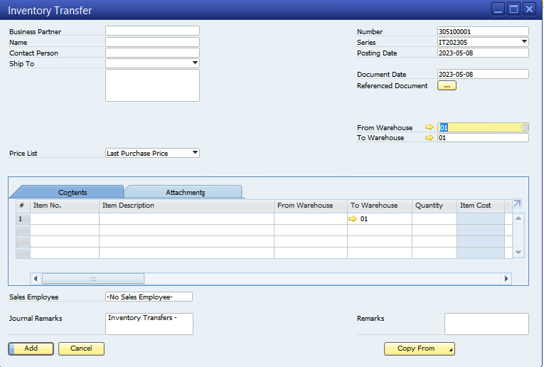

#Pengenalan

Panduan ini bertujuan untuk memberikan pengetahuan dan pemahaman tentang penggunaan Warehouse Management System di SAP Business One dalam mengelola gudang secara efisien dan efektif. Dalam panduan ini, pembaca akan mempelajari tentang konfigurasi sistem, proses barang masuk, barang keluar, dan pindah tempat, serta pelaporan dan analisis yang terkait dengan penggunaan Warehouse Management System di SAP Business One.

Tujuan dari panduan ini adalah untuk memberikan panduan praktis bagi para pengguna sistem untuk mengoptimalkan penggunaan Warehouse Management System di SAP Business One, sehingga mereka dapat mengelola gudang dengan lebih efisien dan efektif. Dalam panduan ini, pembaca akan mempelajari tentang berbagai fitur dan fungsionalitas yang ditawarkan oleh Warehouse Management System di SAP Business One, sehingga mereka dapat memaksimalkan penggunaan sistem ini untuk meningkatkan produktivitas dan efisiensi operasi gudang.

Dengan membaca panduan ini, para pengguna sistem akan mendapatkan pemahaman yang lebih mendalam tentang cara menggunakan Warehouse Management System di SAP Business One untuk mengoptimalkan operasi gudang mereka, sehingga mereka dapat mengelola stok dengan lebih efektif dan mengurangi biaya operasional gudang. Panduan ini juga akan membantu para pengguna sistem untuk memahami berbagai masalah dan tantangan yang sering dihadapi dalam pengelolaan gudang, dan memberikan solusi praktis untuk mengatasi masalah tersebut.

Dengan demikian, panduan ini dapat menjadi sumber daya yang sangat berguna bagi para pengguna sistem yang ingin memaksimalkan penggunaan Warehouse Management System di SAP Business One dalam mengelola gudang mereka dengan lebih efisien dan efektif.

---

## WMS 

Warehouse Management System (WMS) adalah sistem perangkat lunak yang digunakan untuk mengelola operasi gudang dan stok secara efektif dan efisien. WMS berfungsi sebagai pengatur dan pengawas operasi gudang, termasuk pengelolaan stok, pemilihan dan pengemasan barang, penerimaan dan pengiriman barang, dan pelacakan inventaris. Sistem ini memungkinkan pengguna untuk mengoptimalkan penggunaan ruang gudang, mengurangi biaya operasional, meningkatkan efisiensi operasional, dan mengoptimalkan kinerja gudang secara keseluruhan.

Dalam WMS, sistem otomatisasi menggunakan teknologi seperti barcode untuk mengidentifikasi dan memantau inventaris secara real-time. Dengan menggunakan teknologi ini, WMS dapat memberikan visibilitas yang lebih baik terhadap inventaris, memungkinkan pengguna untuk mengambil keputusan yang lebih cerdas dan berdasarkan data dalam mengelola operasi gudang.

WMS juga dapat terintegrasi dengan data SAP B1 (IGU, BWN, SCA, CKI DLL), yang memungkinkan pengguna untuk mengakses data inventaris secara real-time dan memungkinkan pengguna untuk mengintegrasikan data inventaris dengan data lain yang terkait dengan operasi bisnis.

Dengan menggunakan WMS, pengguna dapat memperoleh manfaat seperti peningkatan efisiensi dan produktivitas, pengurangan kesalahan operasional, pengurangan biaya operasional, peningkatan kepuasan pelanggan, dan peningkatan kualitas layanan. Oleh karena itu, WMS menjadi suatu solusi yang sangat penting bagi perusahaan yang ingin meningkatkan kinerja gudang dan mengoptimalkan operasi bisnis mereka secara keseluruhan.

---

## Fitur-Fitur 

_Warehouse Management System (WMS) di SAP Business One menyediakan fitur-fitur lengkap yang dapat membantu pengguna mengelola operasi gudang secara efektif dan efisien. Beberapa fitur utama dari WMS di SAP Business One adalah sebagai berikut:_

### Konfigurasi lokasi gudang dan area penyimpanan

WMS di SAP Business One memungkinkan pengguna untuk menyiapkan master data untuk gudang dan lokasi penyimpanan, sehingga pengguna dapat mengelola operasi gudang dengan lebih terstruktur. Pengguna dapat memilih dari berbagai jenis lokasi seperti rak, palet, atau rak konvensional, dan dapat menentukan area penyimpanan yang sesuai untuk barang tertentu.
 

### Penerimaan Barang Masuk 
 

### Pengambilan Barang Keluar 

WMS di SAP Business One memungkinkan pengguna untuk memproses Barang Keluar dengan efisien. Pengguna dapat mempersiapkan pesanan dan memilih barang secara otomatis, melakukan pengemasan dan pengecekan kualitas barang, serta memproses pengiriman barang dengan mudah.
 

### Pindah Tempat 

WMS di SAP Business One memungkinkan pengguna untuk memindahkan barang dari satu lokasi ke lokasi lain dalam gudang dengan mudah. Pengguna dapat mempersiapkan permintaan pemindahan barang dan memindahkan barang dari satu lokasi ke lokasi lain dengan mudah dan cepat.

### Manajemen Stok 

WMS di SAP Business One memungkinkan pengguna untuk mengelola stok secara efisien dan akurat. Pengguna dapat melakukan penyesuaian stok dan pembaruan data stok secara otomatis, serta mengakses data stok secara real-time.
 
### Pelaporan dan Analisis 

WMS di SAP Business One menyediakan laporan dan analisis yang terkait dengan pengelolaan gudang dan stok. Pengguna dapat melihat laporan stok dan mutasi barang, menganalisis data stok dan pengiriman barang, serta membuat laporan kinerja gudang.

Dengan fitur-fitur yang lengkap dan mudah digunakan, WMS di SAP Business One dapat membantu pengguna mengoptimalkan penggunaan gudang mereka dan meningkatkan kinerja operasional secara keseluruhan.
