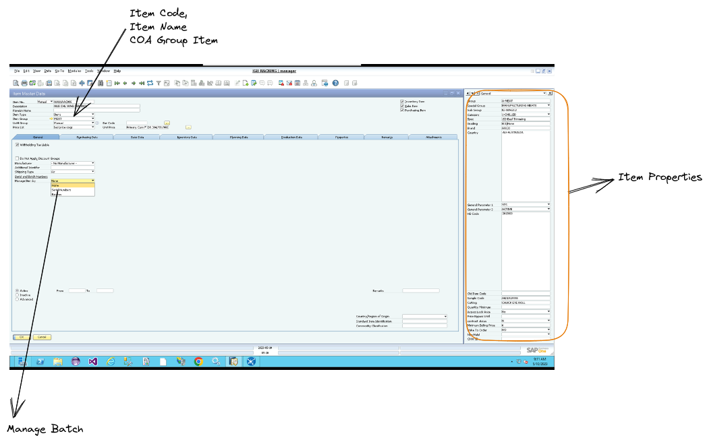

# Konfigurasi Sistem
 

## Menyiapkan Master Data Untuk Gudang Dan Lokasi

Konfigurasi sistem dalam Warehouse Management System (WMS) sangat penting untuk memastikan pengelolaan gudang yang efektif dan efisien. Salah satu aspek penting dari konfigurasi sistem adalah menyiapkan master data untuk gudang dan lokasi. Berikut adalah beberapa langkah yang perlu dilakukan untuk menyiapkan master data gudang dan lokasi dalam WMS:


**[Location]**


| Location | Location Code |
|---|---|
| Gudang IGU  | A |
| Gudang IGU Cikupa | B |
| Gudang Makasar | C |
| Gudang Bandung | D |
| Gudang Jogja | E |
| Gudang Semarang | F |
| Gudang Surabaya | G |
| Gudang Bali | H |
| Gudang Balikpapan | I |
| Gudang Palembang | J |


**[warehouse]**


| Warehouse | Warehouse Code |
|---|---|
| Pondok Bambu Gdg Baru | A1 |
| Pondok Bambu Gdg Lama | A2 |
| Pondok Bambu Gdg Pork | A3 |
| Cikupa IGU | B1 |
| Cikupa IMS | B2 |
| Cikupa BWN | B3 |
| Cikupa SARKUL | B4 |
| Gudang Makasar | C1 |
| Gudang Bandung | D1 |
| Gudang Jogja | E1 |
| Gudang Semarang | F1 |
| Gudang Surabaya | G1 |
| Gudang Bali | H1 |
| Gudang Balikpapan | I1 |
| Gudang Palembang | J1 |

Untuk barang yang akan di kelola melalui ```Batch``` 

#### Membuat Master Data untuk Gudang

Langkah pertama dalam menyiapkan master data untuk gudang adalah membuat profil untuk gudang tersebut. Profil gudang akan mencakup informasi seperti nama gudang, alamat, nomor telepon, dan jenis barang yang disimpan di gudang tersebut. Dalam SAP Business One, pengguna dapat memasukkan informasi ini ke dalam modul Master Data.


#### lokasi Penyimpanan

Setelah membuat profil gudang, pengguna perlu menentukan lokasi penyimpanan di dalam gudang. Dalam WMS, pengguna dapat menentukan lokasi penyimpanan untuk setiap jenis barang. Misalnya, barang yang memerlukan suhu khusus akan disimpan di area khusus dengan suhu yang terkontrol. Untuk membuat lokasi penyimpanan, pengguna dapat memasukkan informasi ini ke dalam modul Master Data.


**Bin Location** 


#### Menetapkan Peraturan Penyimpanan

Setelah menentukan lokasi penyimpanan, pengguna perlu menetapkan peraturan penyimpanan untuk setiap jenis barang. Peraturan penyimpanan akan mencakup informasi seperti jumlah maksimum barang yang dapat disimpan di lokasi penyimpanan tertentu, waktu maksimum yang barang dapat disimpan, dan jenis pengemasan yang harus digunakan untuk barang tertentu. Pengguna dapat memasukkan peraturan penyimpanan ini ke dalam modul konfigurasi WMS.

#### Membuat Stok Awal 

Setelah menyiapkan master data untuk gudang dan lokasi, pengguna perlu membuat stok awal untuk setiap jenis barang. Stok awal akan mencakup informasi tentang jumlah barang yang tersedia di gudang pada saat peluncuran sistem WMS. Pengguna dapat memasukkan informasi ini ke dalam modul konfigurasi WMS.

Dengan menyiapkan master data gudang dan lokasi dengan benar, pengguna dapat memaksimalkan penggunaan WMS dalam pengelolaan stok dan operasi gudang. Pengguna dapat memastikan bahwa stok terorganisir dengan baik dan dapat diakses dengan mudah, dan dapat mengurangi kesalahan yang terjadi dalam pengelolaan gudang.


### Konfigurasi  Alur Kerja

Konfigurasi alur kerja untuk Barang Masuk, Barang Keluar, dan Pindah Tempat sangat penting dalam Warehouse Management System (WMS). Dengan menentukan alur kerja yang tepat, pengguna dapat memastikan bahwa proses operasi gudang berjalan lancar dan efisien. Berikut adalah beberapa langkah yang dapat dilakukan dalam konfigurasi alur kerja untuk Barang Masuk, Barang Keluar, dan Pindah Tempat di WMS:


#### Barang Masuk

Dalam konfigurasi alur kerja untuk Barang Masuk, pengguna dapat menentukan prosedur penerimaan barang dari pemasok dan pemeriksaan kualitas. Setelah penerimaan barang, pengguna dapat menentukan prosedur pemindahan barang dari area penerimaan ke area penyimpanan yang tepat. Selain itu, pengguna juga dapat menentukan prosedur untuk memperbarui data barang dan stok di sistem setelah proses Barang Masuk selesai.


#### Barang Keluar

Dalam konfigurasi alur kerja untuk Barang Keluar, pengguna dapat menentukan prosedur untuk mempersiapkan pesanan dan memilih barang secara otomatis. Selanjutnya, pengguna dapat menentukan prosedur untuk melakukan pengemasan dan pengecekan kualitas barang sebelum barang dikirimkan ke pelanggan. Setelah proses pengiriman barang selesai, pengguna dapat menentukan prosedur untuk memperbarui data stok di sistem.


#### Pindah Tempat

Dalam konfigurasi alur kerja untuk Pindah Tempat, pengguna dapat menentukan prosedur permintaan pemindahan barang. Selanjutnya, pengguna dapat menentukan prosedur pemindahan barang dari satu lokasi ke lokasi lain dalam gudang, dan menentukan prosedur untuk memperbarui data stok di sistem setelah pemindahan selesai.

#### Integrasi dengan Sistem Lain

Dalam konfigurasi alur kerja untuk Barang Masuk, Barang Keluar, dan Pindah Tempat, pengguna juga dapat menentukan integrasi dengan SAP B1 IGU, CKI, SCA dll. Integrasi dengan sistem lain dapat memungkinkan pengguna untuk memperoleh informasi yang lebih terperinci tentang inventaris dan operasi gudang secara keseluruhan.


 


Dengan konfigurasi alur kerja yang tepat, pengguna dapat memastikan bahwa operasi gudang berjalan dengan efisien dan efektif. Proses operasi gudang dapat dioptimalkan, sehingga pengguna dapat menghemat waktu dan biaya operasional, dan meningkatkan kepuasan pelanggan dengan mempercepat pengiriman barang.

### Menyiapkan data rumah potong (est) dan tanggal produksi 

Menyiapkan data rumah potong (est) dan tanggal produksi untuk barang yang disimpan sangat penting dalam pengelolaan stok di Warehouse Management System (WMS). Dalam SAP Business One, pengguna dapat menyiapkan informasi ini melalui modul konfigurasi WMS. Berikut adalah beberapa langkah yang dapat dilakukan untuk menyiapkan data rumah potong (est) dan tanggal produksi untuk barang yang disimpan di gudang:


#### Membuat Profil Barang

Langkah pertama dalam menyiapkan data rumah potong (est) dan tanggal produksi adalah membuat profil untuk setiap jenis barang yang disimpan di gudang. Profil barang akan mencakup informasi seperti nama barang, kode barang, dan deskripsi barang.


 


#### Menambahkan Data Rumah Potong (est) dan Tanggal Produksi

Setelah membuat profil barang, pengguna dapat menambahkan informasi data rumah potong (est) dan tanggal produksi untuk setiap jenis barang. Data rumah potong (est) adalah informasi tentang tempat di mana barang diambil atau dipotong dari sumbernya, seperti peternakan atau perkebunan. Tanggal produksi adalah tanggal ketika barang diproduksi. Informasi ini akan membantu pengguna dalam pengaturan stok berdasarkan umur dan kualitas barang.


 


 


#### Menetapkan Peraturan Penyimpanan 

Setelah menambahkan informasi data rumah potong (est) dan tanggal produksi, pengguna dapat menetapkan peraturan penyimpanan untuk setiap jenis barang berdasarkan informasi tersebut. Peraturan penyimpanan akan mencakup informasi seperti jumlah maksimum barang yang dapat disimpan di lokasi penyimpanan tertentu, waktu maksimum yang barang dapat disimpan, dan jenis pengemasan yang harus digunakan untuk barang tertentu.


**[Batch Detail]**

 


#### Memasukkan Data ke Dalam Sistem

Setelah menetapkan peraturan penyimpanan, pengguna dapat memasukkan data rumah potong (est) dan tanggal produksi ke dalam sistem. Dalam SAP Business One, pengguna dapat memasukkan informasi ini ke dalam modul konfigurasi WMS.

Dengan menyiapkan data rumah potong (est) dan tanggal produksi untuk barang yang disimpan dengan benar, pengguna dapat memantau umur dan kualitas barang, dan mengoptimalkan pengelolaan stok berdasarkan informasi tersebut. Hal ini dapat membantu pengguna dalam pengaturan rotasi stok, sehingga barang yang lebih lama dapat diambil terlebih dahulu dan barang yang lebih baru dapat disimpan lebih lama. Dalam jangka panjang, ini dapat mengurangi limbah dan biaya operasional, serta meningkatkan kualitas barang yang disimpan di gudang.