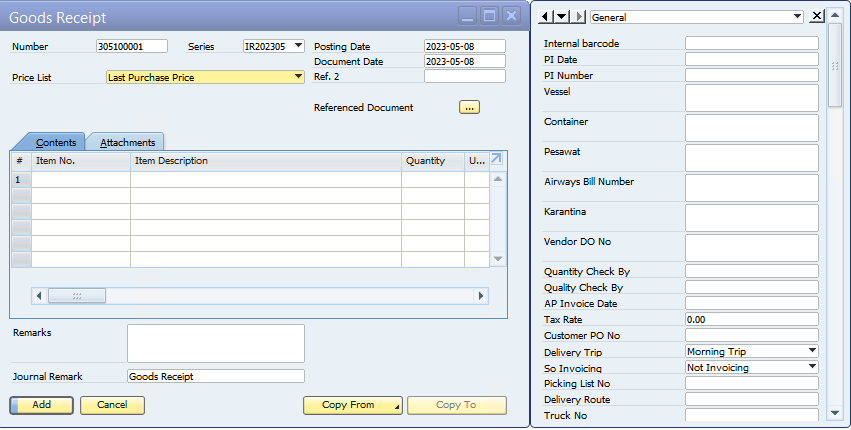
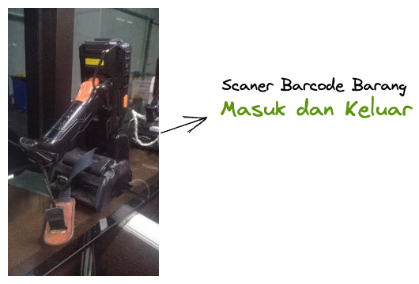
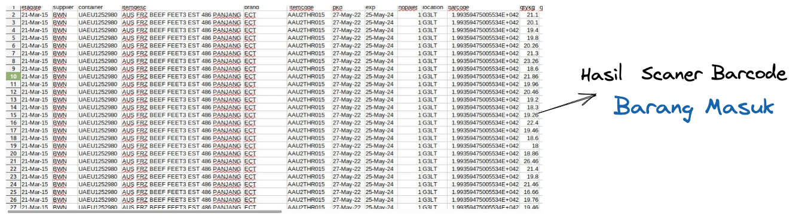
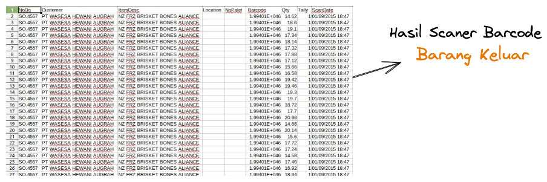

# Barang Masuk

## Proses Barang Masuk 

Proses Barang Masuk adalah salah satu proses penting dalam Warehouse Management System (WMS) di SAP Business One. Berikut adalah langkah-langkah untuk proses Barang Masuk dalam sistem WMS di SAP Business One:

 

### Membuat Pesanan Pembelian

Langkah pertama dalam proses Barang Masuk adalah membuat pesanan pembelian. Pesanan pembelian berisi informasi tentang barang yang akan dibeli dari pemasok, termasuk jumlah barang, harga, dan waktu pengiriman. Dalam SAP Business One, pengguna dapat membuat pesanan pembelian melalui modul Pembelian.


### Penerimaan Barang

Setelah pesanan pembelian dibuat, pengguna dapat menerima barang dari pemasok. Dalam SAP Business One, pengguna dapat memindai barcode atau nomor seri untuk mengidentifikasi barang yang diterima, dan mengkonfirmasi jumlah barang yang diterima.


### Pemeriksaan Kualitas Barang

Setelah barang diterima, pengguna dapat melakukan pemeriksaan kualitas untuk memastikan bahwa barang yang diterima sesuai dengan spesifikasi yang diinginkan. Pemeriksaan kualitas dapat mencakup pengujian fisik, pengujian fungsional, atau pengujian lain yang sesuai dengan jenis barang yang diterima.


### Pemindahan Barang ke Area Penyimpanan

Setelah barang diterima dan diperiksa kualitasnya, pengguna dapat memindahkan barang ke area penyimpanan yang sesuai dalam gudang. Dalam SAP Business One, pengguna dapat menggunakan sistem barcode untuk memindahkan barang secara otomatis ke lokasi penyimpanan yang tepat.

### Perbarui Data Stok

Setelah barang dipindahkan ke area penyimpanan, pengguna dapat memperbarui data stok dalam sistem WMS. Dalam SAP Business One, pengguna dapat memperbarui data stok secara otomatis dengan menggunakan sistem barcode, atau dengan memasukkan informasi stok secara manual ke dalam sistem.

Dengan mengikuti langkah-langkah ini, pengguna dapat memproses Barang Masuk dengan efisien dan efektif dalam sistem WMS di SAP Business One. Proses Barang Masuk yang baik dapat membantu pengguna dalam mengelola stok dan operasi gudang dengan lebih terstruktur, sehingga dapat meningkatkan efisiensi dan produktivitas operasional gudang secara keseluruhan.


## Penerimaan Barang Dari  Pemasok

Penerimaan barang dari pemasok dan pemeriksaan kualitas adalah dua langkah penting dalam proses Barang Masuk dalam Warehouse Management System (WMS). Berikut adalah penjelasan lebih lanjut tentang kedua langkah ini:


### Penerimaan Barang dari Pemasok

Langkah pertama dalam proses Barang Masuk adalah menerima barang dari pemasok. Dalam WMS, penerimaan barang dapat dilakukan dengan beberapa cara, seperti:

* **Penerimaan manual**: Barang diterima secara manual dengan mencocokkan nomor pesanan pembelian dengan nomor penerimaan barang. Pengguna dapat memasukkan informasi jumlah barang yang diterima dan memeriksa keadaan barang untuk memastikan bahwa barang yang diterima sesuai dengan pesanan pembelian.


* **Penerimaan otomatis**: Barang diterima secara otomatis menggunakan teknologi seperti barcode. Dalam sistem WMS, pengguna dapat memindai barcode untuk mengidentifikasi barang yang diterima dan memasukkan informasi jumlah barang yang diterima.



Setelah barang diterima, pengguna dapat memastikan bahwa jumlah barang yang diterima sesuai dengan jumlah yang dipesan dalam pesanan pembelian. Jika ada ketidakcocokan antara jumlah barang yang diterima dan jumlah yang dipesan, pengguna harus segera menghubungi pemasok untuk menyelesaikan masalah tersebut.


 



### Pemeriksaan Kualitas Barang

Setelah barang diterima, langkah selanjutnya adalah melakukan pemeriksaan kualitas untuk memastikan bahwa barang yang diterima memenuhi spesifikasi yang diinginkan. Pemeriksaan kualitas dapat mencakup beberapa hal, seperti:

* Pengujian fisik: Pemeriksaan fisik untuk memastikan bahwa barang tidak rusak atau cacat fisik.
* Pengujian fungsional: Pengujian untuk memastikan bahwa barang dapat berfungsi dengan baik sesuai dengan spesifikasi yang diinginkan.
* Pengujian kualitas: Pengujian untuk memastikan bahwa barang memenuhi standar kualitas yang diinginkan.


Pengguna dapat menggunakan teknologi seperti barcode untuk mengidentifikasi barang yang diterima dan melakukan pemeriksaan kualitas secara otomatis. Setelah pemeriksaan kualitas selesai, pengguna dapat memutuskan untuk menerima atau menolak barang tersebut. Jika barang tidak memenuhi spesifikasi yang diinginkan, pengguna harus segera menghubungi pemasok untuk menyelesaikan masalah tersebut.

Dengan melakukan penerimaan barang dari pemasok dan pemeriksaan kualitas dengan baik, pengguna dapat memastikan bahwa barang yang diterima sesuai dengan pesanan pembelian dan memenuhi spesifikasi kualitas yang diinginkan. Hal ini dapat membantu pengguna dalam mengelola stok dan operasi gudang dengan lebih terstruktur, sehingga dapat meningkatkan efisiensi dan produktivitas operasional gudang secara keseluruhan.


## Pemindahan Barang

Pemindahan barang dari area penerimaan ke area penyimpanan adalah langkah penting dalam proses Barang Masuk dalam Warehouse Management System (WMS). Dalam WMS, pemindahan barang dilakukan dengan memindahkan barang dari area penerimaan ke area penyimpanan menggunakan tenaga manusia. Pengguna dapat menggunakan alat seperti keranjang atau troli atau forklift untuk memindahkan barang dengan efisien.


Berikut adalah langkah-langkah yang dapat dilakukan untuk pemindahan barang dari area penerimaan ke area penyimpanan dalam WMS:

### Identifikasi Barang

Langkah pertama dalam pemindahan barang adalah mengidentifikasi barang yang akan dipindahkan. Dalam WMS, pengguna dapat menggunakan teknologi barcode untuk mengidentifikasi barang secara otomatis dan memastikan bahwa barang yang dipindahkan adalah barang yang tepat.


### Pilih Lokasi Penyimpanan yang Tepat

Setelah barang diidentifikasi, pengguna dapat memilih lokasi penyimpanan yang tepat untuk barang tersebut. Dalam WMS, pengguna dapat menggunakan sistem penempatan barang secara otomatis berdasarkan kategori barang, ukuran, dan faktor lainnya.


### Pindahkan Barang

Setelah lokasi penyimpanan dipilih, pengguna dapat memindahkan barang dari area penerimaan ke area penyimpanan dengan menggunakan alat bantu seperti troli atau forklift. Pengguna dapat memastikan bahwa barang dipindahkan dengan aman dan tepat ke lokasi penyimpanan yang telah dipilih sebelumnya.


### Perbarui Data Stok

Setelah barang dipindahkan ke lokasi penyimpanan yang tepat, pengguna dapat memperbarui data stok dalam sistem WMS. Dalam WMS, pengguna dapat memperbarui data stok secara otomatis dengan menggunakan sistem barcode atau dengan memasukkan informasi stok secara manual ke dalam sistem.

Dengan melakukan pemindahan barang dari area penerimaan ke area penyimpanan dengan baik, pengguna dapat memastikan bahwa barang yang diterima dari pemasok disimpan dengan benar dan efisien di gudang. Pemindahan barang yang efektif dapat membantu pengguna dalam mengoptimalkan pengelolaan stok dan operasi gudang, sehingga dapat meningkatkan efisiensi dan produktivitas operasional gudang secara keseluruhan.

## Pembaruan stok dan data barang di sistem

Pembaruan stok dan data barang di sistem adalah langkah penting dalam Warehouse Management System (WMS). Dalam WMS, pengguna dapat memperbarui stok dan data barang ```secara otomatis``` atau manual. Berikut adalah penjelasan lebih lanjut tentang pembaruan stok dan data barang di sistem:


### Pembaruan Stok

Pembaruan stok adalah langkah untuk memperbarui informasi stok barang yang tersimpan di gudang. Pembaruan stok dapat dilakukan secara otomatis atau manual. ```Pembaruan stok otomatis dilakukan menggunakan teknologi barcode untuk memindai barcode atau nomor seri barang yang masuk atau keluar dari gudang. Dalam sistem WMS, setiap kali barang masuk atau keluar dari gudang, jumlah stok barang akan secara otomatis diperbarui```.


Pembaruan stok manual dilakukan dengan memasukkan informasi jumlah barang yang masuk atau keluar dari gudang ke dalam sistem WMS secara manual. Pengguna dapat menggunakan alat bantu seperti formulir atau ```aplikasi mobile``` untuk memperbarui informasi stok secara manual.


### Pembaruan Data Barang

Pembaruan data barang adalah langkah untuk memperbarui informasi tentang barang yang tersimpan di gudang. Informasi yang perlu diperbarui meliputi nama barang, deskripsi barang, kode barang, jenis barang, dan lain sebagainya. Dalam WMS, pengguna dapat memperbarui informasi barang secara manual atau menggunakan teknologi barcode.

Pembaruan data barang manual dilakukan dengan memasukkan informasi barang yang diperbarui ke dalam sistem WMS secara manual. Pengguna dapat menggunakan alat bantu seperti formulir atau aplikasi mobile untuk memperbarui informasi barang secara manual.


    Pembaruan data barang otomatis dilakukan menggunakan teknologi barcode untuk memindai barcode atau nomor seri barang dan memperbarui informasi barang yang terkait dengan nomor seri tersebut secara otomatis.

Dalam WMS, pembaruan stok dan data barang sangat penting untuk memastikan bahwa informasi stok dan informasi barang yang tersimpan di gudang selalu akurat dan terbaru. Hal ini akan membantu pengguna dalam mengelola stok dan operasi gudang dengan lebih terstruktur, sehingga dapat meningkatkan efisiensi dan produktivitas operasional gudang secara keseluruhan.