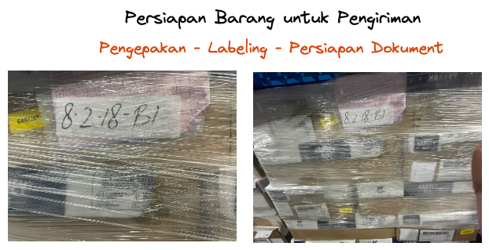

#  Barang Keluar

Proses Barang Keluar adalah salah satu proses penting dalam Warehouse Management System (WMS) di SAP Business One. Berikut adalah langkah-langkah untuk proses Barang Keluar dalam sistem WMS di SAP Business One:


**Membuat Pesanan Penjualan** 

Langkah pertama dalam proses Barang Keluar adalah membuat pesanan penjualan. Pesanan penjualan berisi informasi tentang barang yang akan dijual kepada pelanggan, termasuk jumlah barang, harga, dan waktu pengiriman. Dalam SAP Business One, pengguna dapat membuat pesanan penjualan melalui modul Penjualan.


**Pemilihan Barang**


Setelah pesanan penjualan dibuat, pengguna dapat memilih barang yang akan dikirim kepada pelanggan. Dalam SAP Business One, pengguna dapat menggunakan sistem barcode untuk memilih barang secara otomatis, atau memilih barang secara manual dengan mencocokkan nomor pesanan penjualan dengan nomor barang yang tersedia di gudang.


**Persiapan Barang untuk Pengiriman**

Setelah barang dipilih, pengguna dapat mempersiapkan barang untuk pengiriman. Persiapan barang dapat mencakup beberapa hal, seperti:
* Pengepakan barang: Barang dikemas dan diatur dalam kemasan yang sesuai dengan ukuran dan jenis barang yang akan dikirim.
  
* Labeling barang: Barang diberi label dengan informasi yang tepat, seperti nama barang, jumlah, dan nomor pesanan penjualan.
  
* Persiapan dokumen: Dokumen yang diperlukan untuk pengiriman, seperti faktur, surat jalan, dan dokumen pengiriman, disiapkan.

 

**Pengiriman Barang**

Setelah persiapan barang selesai, pengguna dapat mengirimkan barang ke pelanggan. Dalam SAP Business One, pengguna dapat menggunakan sistem barcode untuk memindai barang yang dikirimkan dan mengonfirmasi bahwa jumlah barang yang dikirimkan sesuai dengan jumlah yang dipesan dalam pesanan penjualan.

**Perbarui Data Stok**

Setelah barang dikirimkan, pengguna dapat memperbarui data stok dalam sistem WMS. Dalam SAP Business One, ```pengguna dapat memperbarui data stok secara otomatis dengan menggunakan sistem barcode```, atau dengan memasukkan informasi stok secara manual ke dalam sistem.

Dengan mengikuti langkah-langkah ini, pengguna dapat memproses Barang Keluar dengan efisien dan efektif dalam sistem WMS di SAP Business One. Proses Barang Keluar yang baik dapat membantu pengguna dalam mengelola stok dan operasi gudang dengan lebih terstruktur, sehingga dapat meningkatkan efisiensi dan produktivitas operasional gudang secara keseluruhan.


## Persiapan pesanan dan pemilihan barang

Persiapan pesanan dan pemilihan barang adalah langkah penting dalam proses Barang Keluar dalam Warehouse Management System (WMS). Berikut adalah penjelasan lebih lanjut tentang kedua langkah ini:

### Persiapan Pesanan
Persiapan pesanan adalah langkah untuk mempersiapkan pesanan penjualan sebelum barang dikirimkan ke pelanggan. Persiapan pesanan dapat mencakup beberapa hal, seperti:

* Konfirmasi pesanan: Pesanan penjualan dikonfirmasi dan disiapkan untuk diproses.

* Pengepakan barang: Barang dikemas dan diatur dalam kemasan yang sesuai dengan ukuran dan jenis barang yang akan dikirim.

* Labeling barang: Barang diberi label dengan informasi yang tepat, seperti nama barang, jumlah, dan nomor pesanan penjualan.

* Persiapan dokumen: Dokumen yang diperlukan untuk pengiriman, seperti faktur, surat jalan, dan tag pengiriman, disiapkan.

Dalam pemilihan barang, penting untuk memastikan bahwa jumlah barang yang akan dikirim sesuai dengan jumlah yang dipesan dalam pesanan penjualan. Jika ada ketidakcocokan antara jumlah barang yang akan dikirim dan jumlah yang dipesan, pengguna harus segera menghubungi pelanggan untuk menyelesaikan masalah tersebut.

Dengan melakukan persiapan pesanan dan pemilihan barang dengan baik, pengguna dapat memastikan bahwa pesanan penjualan diproses dengan benar dan efisien di gudang. Hal ini dapat membantu pengguna dalam mengoptimalkan pengelolaan stok dan operasi gudang, sehingga dapat meningkatkan efisiensi dan produktivitas operasional gudang secara keseluruhan.


### Pengemasan dan pengecekan kualitas barang

Pengemasan dan pengecekan kualitas barang adalah dua langkah penting dalam proses Barang Keluar dalam Warehouse Management System (WMS). Berikut adalah penjelasan lebih lanjut tentang kedua langkah ini:

#### Pengemasan Barang

Pengemasan barang adalah langkah untuk mempersiapkan barang sebelum dikirim ke pelanggan. Pengemasan barang mencakup beberapa hal, seperti:

* Pengepakan barang: Barang dikemas dan diatur dalam kemasan yang sesuai dengan ukuran dan jenis barang yang akan dikirim.
  
* Labeling barang: Barang diberi label dengan informasi yang tepat, seperti nama barang, jumlah, dan nomor pesanan penjualan.
  
* Persiapan dokumen: Dokumen yang diperlukan untuk pengiriman, seperti faktur, surat jalan, dan tag pengiriman, disiapkan.

Dalam WMS, pengemasan barang dapat dilakukan dengan memilih kemasan yang sesuai dengan ukuran dan jenis barang yang akan dikirim dan mengemas barang tersebut dengan tangan. 

#### Pengecekan Kualitas Barang

Pengecekan kualitas barang adalah langkah untuk memastikan bahwa barang yang akan dikirim ke pelanggan berkualitas baik dan tidak cacat. Pengecekan kualitas barang mencakup beberapa hal, seperti:


* Pemeriksaan visual: Barang diperiksa secara visual untuk memastikan bahwa tidak ada kerusakan atau cacat pada barang.
  
* Pemeriksaan fungsional: Barang dites untuk memastikan bahwa fungsi barang berjalan dengan baik.
  
* Pemeriksaan kualitas: Barang diperiksa untuk memastikan bahwa kualitas barang sesuai dengan standar yang ditetapkan.

Dalam WMS, pengecekan kualitas barang dapat dilakukan dengan memeriksa barang secara visual, menguji barang secara manual, dan memverifikasi bahwa barang berkualitas baik. 

Dengan melakukan pengemasan dan pengecekan kualitas barang dengan baik, pengguna dapat memastikan bahwa barang yang dikirim ke pelanggan dalam kondisi baik dan sesuai dengan standar yang ditetapkan. Hal ini dapat membantu pengguna dalam meningkatkan kepuasan pelanggan dan membangun reputasi baik dalam bisnis.

### Pengiriman barang dan pembaruan stok di sistem

Pengiriman barang dan pembaruan stok di sistem adalah dua langkah penting dalam proses Barang Keluar dalam Warehouse Management System (WMS). Berikut adalah penjelasan lebih lanjut tentang kedua langkah ini:

#### Pengiriman Barang

Pengiriman barang adalah langkah untuk mengirimkan barang yang sudah dipilih dan dikemas ke pelanggan. Pengiriman barang mencakup beberapa hal, seperti:

* Pengepakan barang: Barang dikemas dan diatur dalam kemasan yang sesuai dengan ukuran dan jenis barang yang akan dikirim.
  
* Labeling barang: Barang diberi label dengan informasi yang tepat, seperti nama barang, jumlah, dan nomor pesanan penjualan.

* Persiapan dokumen: Dokumen yang diperlukan untuk pengiriman, seperti faktur, surat jalan, dan tag pengiriman, disiapkan.
  
* Pengiriman barang: Barang dikirim ke pelanggan sesuai dengan jadwal pengiriman yang sudah disepakati.

Dalam WMS, pengiriman barang dapat dilakukandengan memuat barang ke dalam kendaraan dan mengirimkannya ke alamat tujuan. 


#### Pembaruan Stok

Pembaruan stok adalah langkah untuk memperbarui informasi stok barang yang tersimpan di gudang setelah barang keluar dari gudang. Pembaruan stok dapat dilakukan dengan memasukkan informasi jumlah barang yang keluar dari gudang ke dalam sistem WMS secara manual. Pengguna dapat menggunakan alat bantu seperti formulir atau aplikasi mobile untuk memperbarui informasi stok secara manual.

Dalam WMS, pembaruan stok sangat penting untuk memastikan bahwa informasi stok yang tersimpan di gudang selalu akurat dan terbaru. Hal ini akan membantu pengguna dalam mengelola stok dan operasi gudang dengan lebih terstruktur, sehingga dapat meningkatkan efisiensi dan produktivitas operasional gudang secara keseluruhan.

Dengan melakukan pengiriman barang dan pembaruan stok dengan baik, pengguna dapat memastikan bahwa proses Barang Keluar berjalan dengan efisien dan efektif dalam sistem WMS. Hal ini dapat membantu pengguna dalam mengoptimalkan pengelolaan stok dan operasi gudang, sehingga dapat meningkatkan efisiensi dan produktivitas operasional gudang secara keseluruhan.