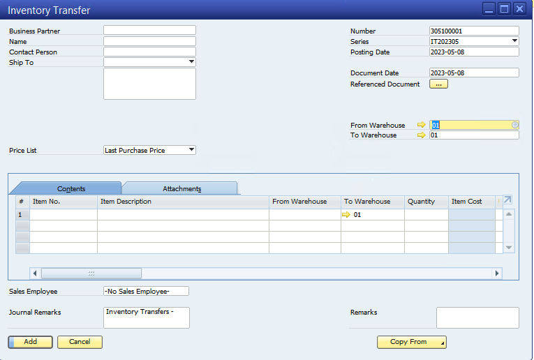

# Pindah Tempat

## Proses Pindah Tempat dalam sistem Warehouse Management System di SAP Business One

 Proses Pindah Tempat adalah salah satu proses penting dalam Warehouse Management System (WMS) di SAP Business One. Proses Pindah Tempat bertujuan untuk memindahkan barang dari satu lokasi gudang ke lokasi lainnya dalam gudang yang sama. Berikut adalah langkah-langkah untuk proses Pindah Tempat dalam sistem WMS di SAP Business One:
 
 


**Membuat Permintaan Pindah Tempat**

Langkah pertama dalam proses Pindah Tempat adalah membuat permintaan pindah tempat. Permintaan pindah tempat berisi informasi tentang barang yang akan dipindahkan, lokasi asal, lokasi tujuan, dan jumlah barang yang akan dipindahkan. Dalam SAP Business One, pengguna dapat membuat permintaan pindah tempat melalui modul Gudang.

**Verifikasi Permintaan Pindah Tempat**

Setelah permintaan pindah tempat dibuat, pengguna harus memverifikasi permintaan tersebut untuk memastikan bahwa informasi yang tertera di dalamnya benar dan lengkap. Verifikasi permintaan pindah tempat dapat dilakukan dengan memeriksa informasi yang tertera di dalamnya, seperti nama barang, lokasi asal, lokasi tujuan, dan jumlah barang yang akan dipindahkan.

**Persiapan Barang untuk Dipindahkan**

Setelah permintaan pindah tempat diverifikasi, pengguna dapat mempersiapkan barang untuk dipindahkan. Persiapan barang dapat mencakup beberapa hal, seperti:

* Pengepakan barang: Barang dikemas dan diatur dalam kemasan yang sesuai dengan ukuran dan jenis barang yang akan dipindahkan.
  
* ```Labeling barang: Barang diberi label dengan informasi yang tepat, seperti nama barang, jumlah, dan nomor permintaan pindah tempat.```
  
* Persiapan dokumen: Dokumen yang diperlukan untuk pindah tempat barang, seperti tag pindah tempat, disiapkan.


**Pemindahan Barang ke Lokasi Tujuan**

Setelah persiapan barang selesai, pengguna dapat memindahkan barang ke lokasi tujuan yang sudah ditentukan dalam permintaan pindah tempat. Dalam SAP Business One, pengguna dapat menggunakan sistem barcode untuk memindai barang yang dipindahkan dan mengonfirmasi bahwa jumlah barang yang dipindahkan sesuai dengan jumlah yang tertera dalam permintaan pindah tempat.

**Perbarui Data Stok**

Setelah barang dipindahkan ke lokasi tujuan, pengguna dapat memperbarui data stok dalam sistem WMS. Dalam SAP Business One, pengguna dapat memperbarui data stok dengan memasukkan informasi stok secara manual ke dalam sistem.

Dengan mengikuti langkah-langkah ini, pengguna dapat memproses Pindah Tempat dengan efisien dan efektif dalam sistem WMS di SAP Business One. Proses Pindah Tempat yang baik dapat membantu pengguna dalam mengelola stok dan operasi gudang dengan lebih terstruktur, sehingga dapat meningkatkan efisiensi dan produktivitas operasional gudang secara keseluruhan.

## Persiapan permintaan pemindahan barang

Persiapan permintaan pemindahan barang adalah langkah penting dalam proses Pindah Tempat di dalam Warehouse Management System (WMS). Berikut adalah penjelasan lebih lanjut tentang persiapan permintaan pemindahan barang:

**Identifikasi Barang yang akan Dipindahkan**

Langkah pertama dalam persiapan permintaan pemindahan barang adalah mengidentifikasi barang yang akan dipindahkan. Pengguna harus memastikan bahwa barang yang akan dipindahkan sudah disediakan dan siap untuk dipindahkan ke lokasi tujuan.

**Tentukan Lokasi Asal dan Tujuan**

Setelah barang yang akan dipindahkan diidentifikasi, pengguna harus menentukan lokasi asal dan tujuan dari pemindahan barang. Lokasi asal adalah lokasi awal barang yang akan dipindahkan, sedangkan lokasi tujuan adalah lokasi akhir barang yang akan dipindahkan.


**Tentukan Jumlah Barang yang Akan Dipindahkan**

Setelah lokasi asal dan tujuan ditentukan, pengguna harus menentukan jumlah barang yang akan dipindahkan. Pengguna dapat menggunakan informasi jumlah barang yang tersedia di lokasi asal dan jumlah barang yang diperlukan di lokasi tujuan untuk menentukan jumlah barang yang harus dipindahkan.


**Buat Permintaan Pemindahan Barang**

Setelah semua informasi yang diperlukan dikumpulkan, pengguna dapat membuat permintaan pemindahan barang. Permintaan pemindahan barang harus mencakup informasi seperti nama barang, lokasi asal, lokasi tujuan, dan jumlah barang yang akan dipindahkan.

Dalam sistem WMS, pengguna dapat membuat permintaan pemindahan barang secara manual dengan memasukkan informasi yang diperlukan ke dalam sistem, atau menggunakan sistem barcode untuk memindai barang yang akan dipindahkan dan mengonfirmasi informasi yang terkait dengan permintaan pemindahan 

Dengan melakukan persiapan permintaan pemindahan barang dengan baik, pengguna dapat memastikan bahwa pemindahan barang dilakukan dengan efisien dan efektif dalam sistem WMS. Hal ini dapat membantu pengguna dalam mengoptimalkan pengelolaan stok dan operasi gudang, sehingga dapat meningkatkan efisiensi dan produktivitas operasional gudang secara keseluruhan.

## Pemindahan barang dan pembaruan stok di sistem

Pemindahan barang dan pembaruan stok adalah dua langkah penting dalam proses Pindah Tempat di dalam Warehouse Management System (WMS). Berikut adalah penjelasan lebih lanjut tentang kedua langkah ini:


### Pemindahan Barang

Pemindahan barang adalah langkah untuk memindahkan barang dari lokasi asal ke lokasi tujuan dalam gudang yang sama. Pemindahan barang mencakup beberapa hal, seperti:

* Pengepakan barang: Barang dikemas dan diatur dalam kemasan yang sesuai dengan ukuran dan jenis barang yang akan dipindahkan.

* ```Labeling barang: Barang diberi label dengan informasi yang tepat, seperti nama barang, jumlah, dan nomor permintaan pemindahan barang.```

* Persiapan dokumen: Dokumen yang diperlukan untuk pemindahan barang, seperti tag pemindahan barang, disiapkan.

* Pemindahan barang: Barang dipindahkan dari lokasi asal ke lokasi tujuan sesuai dengan permintaan pemindahan barang.

Dalam WMS, pemindahan barang dilakukan dengan memuat barang ke dalam kendaraan dan memindahkannya ke lokasi tujuan. 


### Pembaruan Stok

Pembaruan stok adalah langkah untuk memperbarui informasi stok barang yang tersimpan di gudang setelah barang dipindahkan ke lokasi tujuan. Pembaruan stok dapat dilakukan secara otomatis atau manual. ```Pembaruan stok otomatis dilakukan menggunakan teknologi barcode untuk memindai barcode atau nomor seri barang yang dipindahkan ke lokasi tujuan. Dalam sistem WMS, setiap kali barang dipindahkan ke lokasi tujuan, jumlah stok barang akan secara otomatis diperbarui```.

Pembaruan stok manual dilakukan dengan memasukkan informasi jumlah barang yang dipindahkan ke lokasi tujuan ke dalam sistem WMS secara manual. Pengguna dapat menggunakan alat bantu seperti formulir atau aplikasi mobile untuk memperbarui informasi stok secara manual.

Dalam WMS, pemindahan barang dan pembaruan stok sangat penting untuk memastikan bahwa informasi stok yang tersimpan di gudang selalu akurat dan terbaru. Hal ini akan membantu pengguna dalam mengelola stok dan operasi gudang dengan lebih terstruktur, sehingga dapat meningkatkan efisiensi dan produktivitas operasional gudang secara keseluruhan.

Dengan melakukan pemindahan barang dan pembaruan stok dengan baik, pengguna dapat memastikan bahwa proses Pindah Tempat berjalan dengan efisien dan efektif dalam sistem WMS. Hal ini dapat membantu pengguna dalam mengoptimalkan pengelolaan stok dan operasi gudang, sehingga dapat meningkatkan efisiensi dan produktivitas operasional gudang secara keseluruhan.

